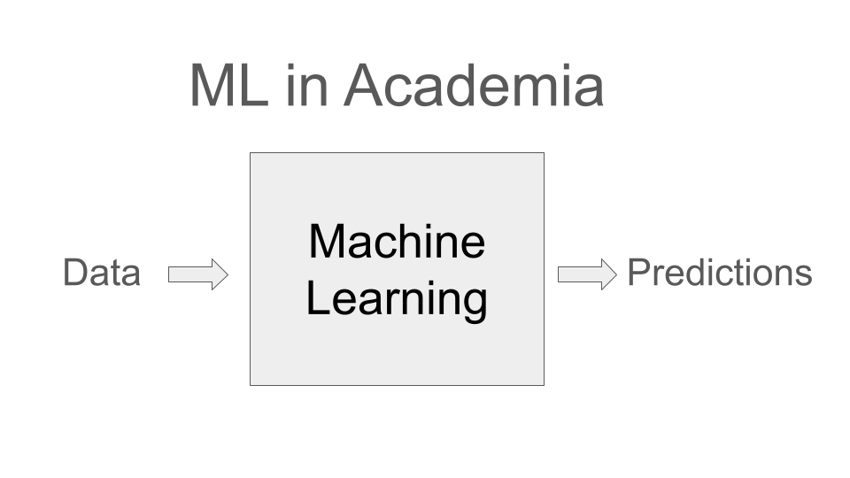
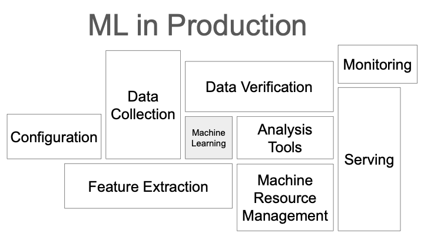

# Data Science Workflow and Applications

Students enrolled at a Berlin University can register for the Course on the [Course Moodle Website](https://lms.bht-berlin.de/course/view.php?id=37443).

<table style="width: 100%; table-layout: fixed;">
	<tr>
		<td style="width: 50%; padding: 0 0.5rem;">
			
		</td>
		<td style="width: 50%; padding: 0 0.5rem;">
			
		</td>
	</tr>
</table>

This course covers end-to-end lifecycle of a Data Science project. The course will be structured in two parts: the first part will cover more general data science workflow topics, teaching you about modern MLOps practices. The second part will be focused on recommender systems, where you will learn about different approaches to building recommendation engines. For your final project, you will be expected to apply the concepts and tools covered in the lectures to build a recommender system for a dataset of your choice (More under: [Final Project](#final-project)).

⚠️ Please note we are currently reworking the lecture and still preparing the course materials. You will find this message wherever the course materials are being updated / not finalized. ⚠️

## Course Structure

Part 1 of the lecture *Data Science Workflow and Applications* will include 5 sessions covering the following topics:

| Date        | Topics                                                                    |
| ----------- | ------------------------------------------------------------------------- |
| 09.04.2026  | [Data Acquisition and Labeling](DSW-sessions/session1_data_acquisition.ipynb)          |
| 16.04.2026  | ⏳ [Kubernetes Cluster and Experiments Logging](DSW-sessions/session2_cluster.ipynb)      |
| 23.04.2026  | ⏳ [Data Exploration, Preprocessing & Quality](DSW-sessions/session3_data_quality.ipynb)  |
| 30.04.2026  | ⏳ [Model Training and Evaluation](DSW-sessions/session4_model_training_evaluation.ipynb) |
| 07.05.2026  | ⏳ [Dashboards and Demos](DSW-sessions/session5_demos.ipynb)                              |

Starting from 14.05.2026, lecturer *Leonhard Liu* will take over, covering topics around *Recommender Systems*.

| Date        | Topics                                                                              |
| ----------- | ----------------------------------------------------------------------------------- |
| 14.05.2026  | ⏳[The Recommendation Problem](DSA-sessions/lecture-06.md)                                     |
| 21.05.2026  | ⏳[Content-Based Methods](DSA-sessions/lecture-07.md)                                          |
| 28.05.2026  | ⏳[Matrix Factorization & AutoRec](DSA-sessions/lecture-08.md)                                 |
| 04.06.2026  | ⏳[Neural Embeddings & Semantic Search](DSA-sessions/lecture-09.md)                            |
| 11.06.2026  | ⏳[Two-Tower, Evaluation & Retrieval](DSA-sessions/lecture-10.md)                              |
